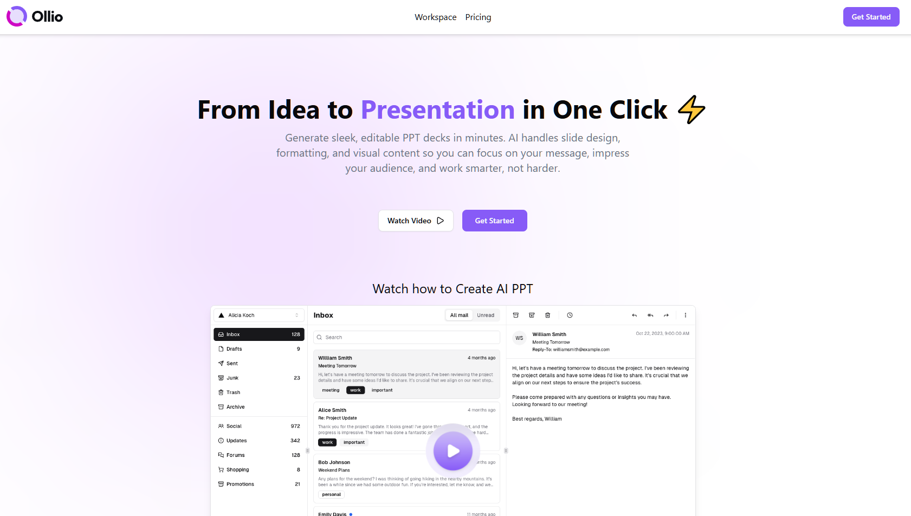

# 🎨 Ai Slide Generator

Um app que usa IA para ajudar a criar apresentações de forma rápida e simples  
Ainda estou ajustando alguns detalhes do código, mas o app já está totalmente funcional

---

### 🏠 Home
Na tela inicial o usuário pode acessar o workspace ou fazer login

  

---

### 💼 Workspace
Aqui ficam listados todos os projetos do usuário  
É possível criar um novo projeto diretamente no prompt e começar a edição

---

### 🧩 Editor de Outline
Depois de criar o projeto o usuário é redirecionado para a tela de outline  
Nessa parte ele define os tópicos e configura as informações que vão gerar os slides

---

### 🎬 Editor de Slide
Com o outline pronto o usuário pode editar cada slide, salvar as mudanças e usar IA para gerar automaticamente o conteúdo  
No final é possível exportar a apresentação pronta

---

### ⚙️ Tecnologias
React  
Firebase  
TypeScript  
TailwindCSS  
[Bidirectional streaming using the Gemini Live API](https://ai-slide-generator.vercel.app).

---

### 🚀 Status
Em desenvolvimento mas já funcional  
